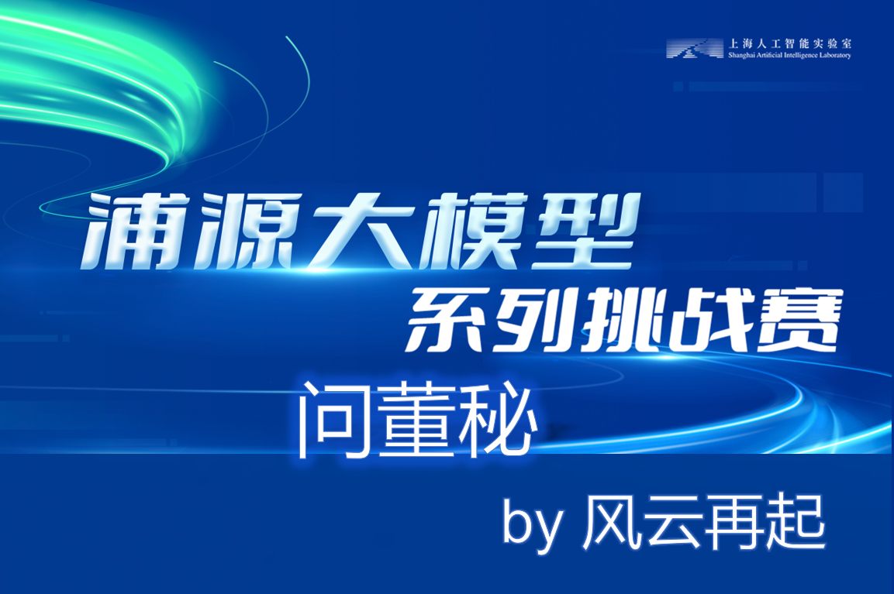
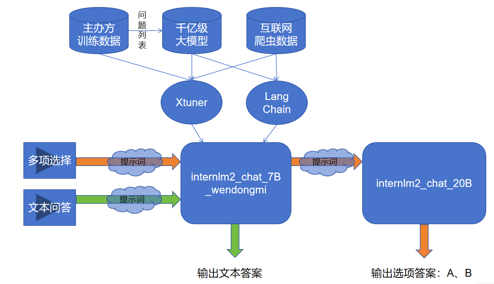
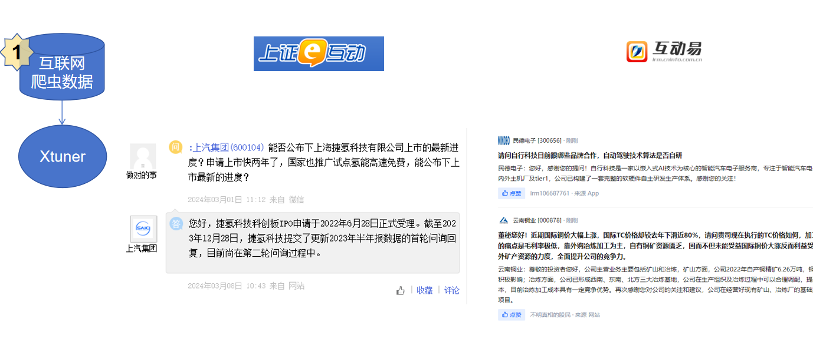
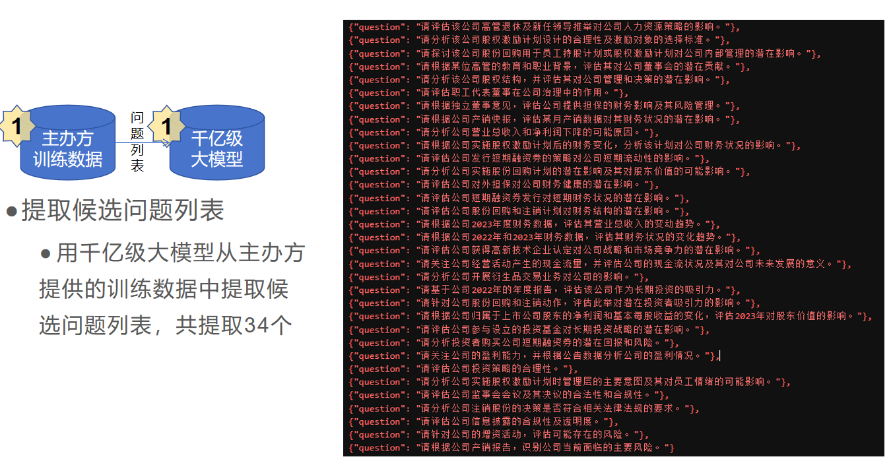
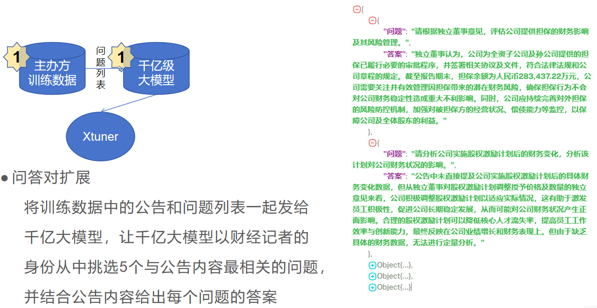

# 问董秘——公告理解大模型
<div align="center">


  <div align="center">
    <b><font size="5">问董秘</font></b>
  </div>

[![license][license-image]][license-url]
[![evaluation][evaluation-image]][evaluation-url]

 [![OpenXLab_Model][OpenXLab_Model-image]][OpenXLab_Model-url] 

[![OpenXLab_App][OpenXLab_App-image]][OpenXLab_App-url] | [🆕Update News](#-news) | [🤔Reporting Issues][Issues-url] 丨 [![bilibili][bilibili-image]][bilibili-url]


[license-image]: ./images/license.svg
[evaluation-image]: ./images/compass_support.svg
[OpenXLab_Model-image]: https://cdn-static.openxlab.org.cn/header/openxlab_models.svg
[OpenXLab_App-image]: https://cdn-static.openxlab.org.cn/app-center/openxlab_app.svg
[bilibili-image]: https://img.shields.io/badge/问董秘-bilibili-%23fb7299

[license-url]: ./LICENSE
[evaluation-url]: https://github.com/internLM/OpenCompass/
[HuggingFace_Model-url]: https://huggingface.co/
[OpenXLab_Model-url]: https://openxlab.org.cn/models/detail/wwewwt/internlm2-chat-7b-wendongmi
[ModelScope-url]: https://www.modelscope.cn/models/
[OpenXLab_App-url]: https://openxlab.org.cn/apps/detail/
[bilibili-url]: https://www.bilibili.com/video/BV1Xx421C7d3/
[Issues-url]: https://github.com/wwewwt/internlm_xlab/issues
[text-url]:./问董秘之文本对话.ipynb
[select-url]:./问董秘之多项选择.ipynb
[train-cfg-url]:./model/internlm2_chat_7b_qlora_oasst1_e10_copy.py

</div>

## 📝目录

- [📖 简介](#-简介)
- [📖 创新点](#-创新点)
- [🚀 News](#-news)
- [🛠️ 使用方法](#%EF%B8%8F-使用方法)
  * [快速开始](#快速开始)
  * [模型训练](#模型训练)
    + [环境搭建](#环境搭建)
    + [训练数据](#训练数据)
    + [微调模型](#微调模型)
    + [模型评测](#模型评测)
- [💕 致谢](#-致谢)
- [开源许可证](#开源许可证)


## 📖 简介

欢迎来到“问董秘”——您的专属智能问答助手，专为解决您对公司高管和董事会秘书的疑问而设计。无论您是想了解公司的最新动态、财务状况，还是对公司的战略方向有疑问，我们的模型都能为您提供准确、及时的回答。

“问董秘”基于InternLM2大模型微调而来。我们的模型不仅能够回答您的问题，更能够理解您的意图，为您提供定制化的信息和建议。

无论您是投资者、分析师、合作伙伴，还是对公司有兴趣的公众，我们的模型都能为您提供最准确、最全面的信息。让您在了解公司的过程中，更加高效、便捷。

“问董秘”，让您的每一次询问，都充满智慧和价值。

如果你觉得这个项目对你有帮助，欢迎 ⭐ Star，让更多的人发现它！

<p align="center">
    
</p>

## 📖 创新点 

#### 🚀 1、以“角色扮演”的思路来实现公告理解大模型，让大模型扮演上市公司的董事会秘书（董秘），通过抓取和整理沪深交易所官方平台上的优质“问董秘”数据，训练出了一个在“政治、社科”领域更强的大模型。

#### 🚀 2、将“从四个选项中找出对的选项并按A、B、C的格式输出”这样一个复杂任务，拆解成“从四个选项中找出对的选项”和“按A、B、C的格式输出”两个子任务，让大模型在“选项抽取”和“选项格式化”两个子任务上的准确率得到提升。

#### 🚀 3、使用千亿大模型扩容领域数据，再结合RAG技术，提升自研大模型的可解释性，增强了自研大模型的领域适应性。


## 🚀 News

[2024.03.16] 问董秘第一版部署上线 https://openxlab.org.cn/models/detail/wwewwt/internlm2-chat-7b-wendongmi 🚀


## 🛠️ 使用方法

### 快速开始

1. 安装环境

```bash
git clone https://github.com/wwewwt/internlm_xlab.git
cd internlm_xlab
pip install -r requirements.txt
```

2. 下载模型

<summary> 从 OpenXLab </summary>

参考 [下载模型](https://openxlab.org.cn/docs/models/%E4%B8%8B%E8%BD%BD%E6%A8%A1%E5%9E%8B.html) 。


```bash
cd model
#请确保已安装 git-lfs 
git lfs install
#下载当前分支
git clone https://code.openxlab.org.cn/wwewwt/internlm2-chat-7b-wendongmi.git
```

3. 基于公告的文本问答 LLM+RAG
在vscode 或者 jupyter 中打开文件 [[问董秘之文本对话]][text-url]

4. 基于公告的多选题 
在vscode 或者 jupyter 中打开文件 [[问董秘之多项选择]][select-url]

### 模型训练

#### 环境搭建

1. 安装xtuner

```bash
pip install -U xtuner
```

#### 训练数据
1. 补充互联网公开数据
从“上证e互动”，“互动易”网站上抓取“问董秘”板块的问答数据
<p align="center">
    
</p>

2. 提取候选问题列表
用千亿级大模型从主办方提供的训练数据中提取候选问题列表，共提取34个
<p align="center">
    
</p>

然后和公告一起，请求千亿参数大模型接口，获取5个问答对：
<p align="center">
    
</p>

3. 格式化成训练数据format：
```bash
[
    {
        "conversation": [
            {
                "system": "你是上市公司的董秘，你乐于助人，诚实无害，你竭诚为投资者解答关于公司运营、财务状况、投资者关系等方面的问题。",
                "input": "2021-1-14，请问贵公司营业执照变更主要现在是扩充了哪些业务？金龙鱼每年从海天购买多少大豆？有具体的数额吗？",
                "output": "公司本次营业执照变更为对公司注册资本的变更，不涉及经营范围的变更。目前，关于大豆方面的情况，公司无需要公开披露的信息。"
            }
        ]
    },
    {
        "conversation": [
            {
                "system": "你是上市公司的董秘，你乐于助人，诚实无害，你竭诚为投资者解答关于公司运营、财务状况、投资者关系等方面的问题。",
                "input": "2021-1-14，原段落没有提供，我假设您想表达的是关于金龙鱼公司的分红问题。那么，经过处理后的句子如下：\n\n金龙鱼公司什么时候分红？",
                "output": "公司将按照章程规定的程序以及股东大会审议通过的《公司首次公开发行股票并上市后未来三年股东分红回报规划》，安排分红派息事宜。"
            }
        ]
    }
]
```


#### 微调模型
1. [[Xtuner配置文件]][train-cfg-url]


2. 模型下载

```bash
mkdir -p /root/model
```
`download.py`

```python
import torch
from modelscope import snapshot_download, AutoModel, AutoTokenizer
import os
model_dir = snapshot_download('Shanghai_AI_Laboratory/internlm2-chat-7b', cache_dir='/root/model')
```

3. 模型训练
```bash
cd model
xtuner train internlm2_chat_7b_qlora_oasst1_e10_copy.py --deepspeed deepspeed_zero2
```

4. PTH 模型转换为 HuggingFace 模型

```bash
mkdir hf
xtuner convert pth_to_hf ./internlm2_chat_7b_qlora_oasst1_e10_copy.py \
                         ./work_dirs/internlm2_chat_7b_qlora_oasst1_e10_copy/epoch_830.pth \
                         ./hf
```

5. HuggingFace 模型合并到大语言模型
```bash
export MKL_SERVICE_FORCE_INTEL=1
export MKL_THREADING_LAYER='GNU'

xtuner convert merge  /root/model/Shanghai_AI_Laboratory/internlm2-chat-7b ./hf merged --max-shard-size 2GB
```


#### 模型评测

- 结果文件与评测数据集可在同目录文件[results](./results)中获取


## 💕 致谢

### 项目成员

- 风云再起-项目负责人 （BAT资深工程师、金融科技公司架构专家）

### 特别鸣谢

<div align="center">

***感谢上海人工智能实验室组织的 浦语大模型系列挑战赛~***

***感谢上海人工智能实验室组织的 书生·浦语实战营 学习活动~***

***感谢 OpenXLab 对项目部署的算力支持~***

***感谢上海人工智能实验室推出的书生·浦语大模型实战营，为我们的项目提供宝贵的技术指导和强大的算力支持！***

[**InternLM-tutorial**](https://github.com/InternLM/tutorial)、[**InternStudio**](https://studio.intern-ai.org.cn/)、[**xtuner**](https://github.com/InternLM/xtuner)

<a href="https://github.com/wwewwt/internlm_xlab/graphs/contributors">
  
</a>

</div>

## 开源许可证

该项目采用 [Apache License 2.0 开源许可证](https://github.com/AXYZdong/AMchat/blob/main/LICENSE) 同时，请遵守所使用的模型与数据集的许可证。
